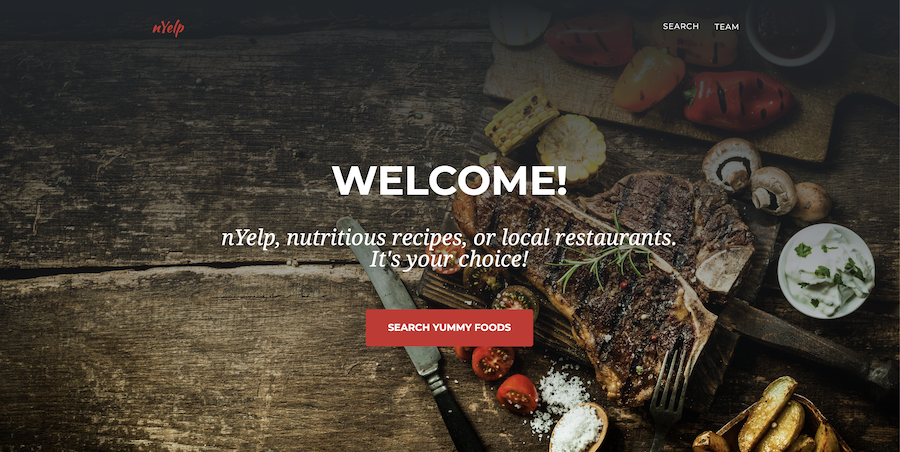

# nYelp

An application where you can search for the nutritional value for foods and meals and find restaurants on yelp that may server them nearby.

-   Get the most detailed Nutritional value for your meal.
-   See a recipe for your meal.
-   Find a location near you that may serve your craving. (edited)

## Installation Instructions

-   `git pull / git merge`
-   `npm install`
-   `npm start` or `gulp watch`

---

© 2019 Amir Amiravand, Cloud Xu, Pablo Motta
